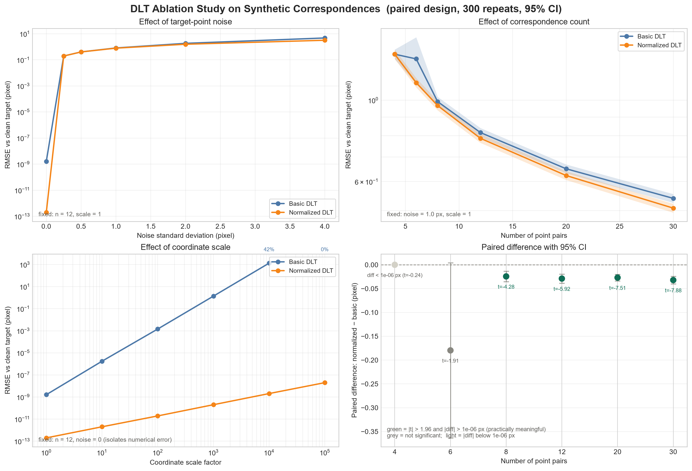
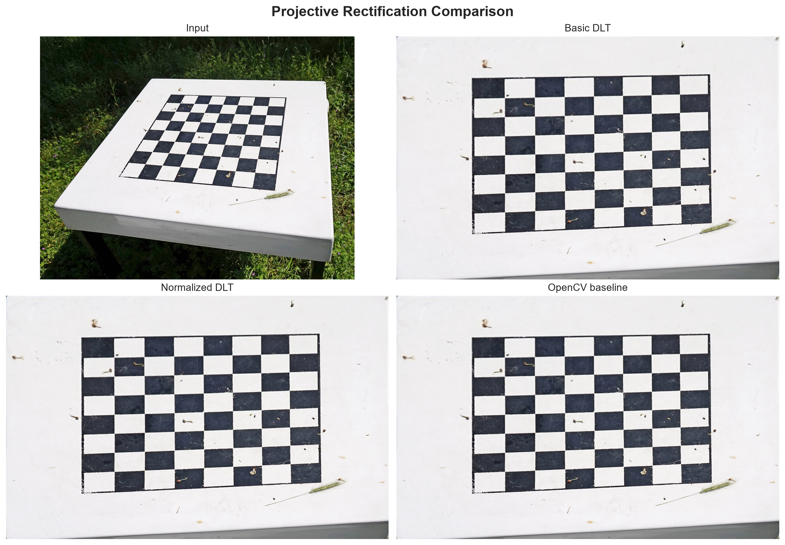
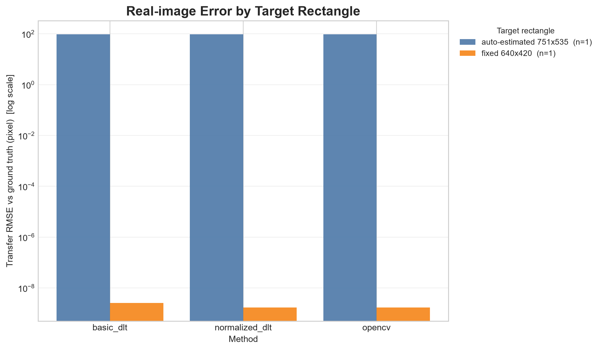
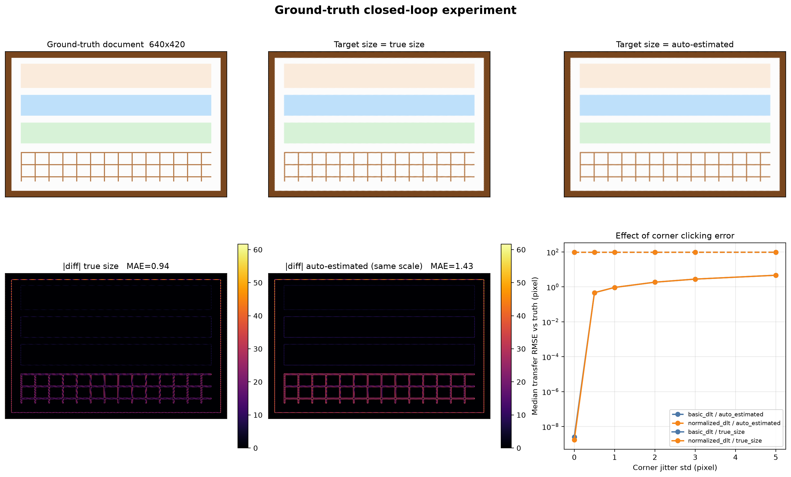

# 射影矩阵自编程实现与透视矫正实验报告

## 摘要

本实验针对斜拍平面图像的透视畸变问题，使用 Python、NumPy 和 OpenCV 完成射影矩阵求解与图像正视化。程序没有把 OpenCV 的透视矩阵求解当作主算法，而是自行构造 DLT 方程矩阵，用 SVD 求解射影矩阵 `H`，并进一步实现点归一化、反归一化、逆向像素映射和双线性插值。

实验包含三类比较：基础 DLT 与归一化 DLT 的方法对照、手写实现与 OpenCV 工程实现的结果对照，以及改变点数、噪声和坐标尺度的消融实验。合成样本的真值可以精确恢复，据此又补充了一组真值闭环实验，使结论具备定量依据。

主要发现如下。

1. 四点场景下常用的"重投影误差"是退化指标。4 对点给出 8 个方程，而 `H` 恰有 8 个自由度，拟合残差在数学上恒为 0，实测为 1e−9 ~ 1e−13，属于机器零。本实验因此改用留出点转移误差作为主要指标。
2. 目标矩形的选择是最大误差源。四点对应只能把图像矫正到射影层面，输出宽高比必须先验给定。实测目标矩形取真值时转移误差为 1.71e−09 px，自动估计时为 95.35 px，相差 11 个数量级。
3. 角点标定误差比目标矩形误差小两个数量级。角点抖动 σ = 1 px 只带来 0.93 px 误差，而宽高比选错带来约 95 px，且无法通过提高角点精度消除。
4. 归一化 DLT 改善的是数值稳定性，不是精度。它把 DLT 矩阵条件数从 1.13e6 降到 3.88；但在常规像素坐标下，它与基础 DLT 的差异小到无法区分，四点场景下两者解出完全相同的 `H`。它的价值在坐标量级极端时才显现。
5. 手写实现是正确的。与 OpenCV `warpPerspective` 的图像 MAE 仅约 1.2e−04 灰度级，两张图几乎逐像素一致。

本实验全部数值由脚本实测得出，可通过 §13.3 的命令复现，结果表无待填项。合成样本走真值闭环，公开数据集 9 张与自拍照片 4 张走批量流程，各图片的角点 JSON 已随项目提供，整条流水线可无交互重跑。

## 1. 实验目的

1. 理解平面射影变换和齐次坐标的含义。
2. 掌握由点对应关系构造 DLT 方程的方法。
3. 使用 SVD 求解齐次线性方程组 `Ah=0`。
4. 理解归一化 DLT 对数值稳定性的作用，并明确它不能解决什么问题。
5. 自己实现从目标像素到源图像像素的逆向映射和双线性插值。
6. 通过对照实验和消融实验分析不同因素对结果的影响。
7. 理解射影矫正与度量矫正的区别，认识输出宽高比依赖先验（§3.6）。
8. 学会识别退化的评价指标：四点恰定时重投影误差恒为 0，改用留出点评估（§7.1、§7.4）。
9. 掌握用合成真值做闭环验证的方法：从已知真值出发，定量度量恢复结果的误差（§6.5）。

## 2. 问题描述

输入是一张包含平面矩形目标的斜拍图片。目标在原图中通常呈现为四边形，希望将其变换为正视的矩形图像。

源图像角点按照以下顺序标定：

```text
左上 TL → 右上 TR → 右下 BR → 左下 BL
```

目标图像角点设为：

```text
(0, 0), (W-1, 0), (W-1, H-1), (0, H-1)
```

其中 `W` 和 `H` 根据源图像四条边的长度自动估计。

## 3. 理论基础

### 3.1 射影变换

源点和目标点满足：

```text
x' ~ Hx
```

其中：

```text
H = [[h11, h12, h13],
     [h21, h22, h23],
     [h31, h32, h33]]
```

展开后：

```text
x' = (h11*x + h12*y + h13) / (h31*x + h32*y + h33)
y' = (h21*x + h22*y + h23) / (h31*x + h32*y + h33)
```

齐次矩阵整体乘以任意非零常数表示同一个射影变换，因此 `H` 有 9 个参数但只有 8 个自由度。本项目不强制令 `h33=1`，而是使用齐次 SVD 解和矩阵范数进行尺度处理。

### 3.2 DLT 方程

对每一对点构造两行方程：

```text
[ x  y  1  0  0  0  -x*x'  -y*x'  -x' ] h = 0
[ 0  0  0  x  y  1  -x*y'  -y*y'  -y' ] h = 0
```

四对点产生 `8×9` 的矩阵 `A`。对更多点时，矩阵大小为 `2n×9`。

### 3.3 SVD 求解

```text
A = UΣVᵀ
```

取最小奇异值对应的右奇异向量，即 `Vᵀ` 的最后一行，重塑为 `3×3` 矩阵得到 `H`。

### 3.4 归一化 DLT

归一化步骤为：

1. 将点集质心平移到原点；
2. 缩放点集，使点到原点的平均距离为 `√2`；
3. 在归一化坐标中执行 DLT；
4. 使用 `H = inv(T_dst) @ H_normalized @ T_src` 反归一化。

归一化可以减少坐标量级差异对 DLT 矩阵条件数的影响。

### 3.5 像素重映射

程序采用逆向映射：

```text
目标像素 → H⁻¹ → 源图像坐标 → 双线性插值 → 输出像素
```

源坐标落在图像外部时使用黑色填充。双线性插值使用源坐标周围的四个像素及其横纵向权重。

### 3.6 射影矫正的度量不确定性

四对点给出 8 个独立约束，射影矩阵 `H` 有 8 个自由度，因此 `H` 被唯一确定。但这个唯一性是相对于指定的目标矩形而言的：`H` 会把源四边形精确地映到你所指定的那个矩形上，无论该矩形的宽高比取什么值。

换言之，`H` 的估计是确定的，但"什么才是正确的正视图"并不由射影变换本身回答。射影变换只能把平面矫正到射影层面，即把直线映成直线、把交比保持住；要得到长度、角度、宽高比都正确的度量结果，还必须额外提供先验信息。

实测验证。合成样本的真值文档尺寸为 640×420（宽高比 1.5238），而程序的 `estimate_output_size` 采用"对边长取较大者"估计，得到 751×535（宽高比 1.4037）。

| 目标矩形 | 宽高比误差 | 单轴拉伸 | 留出点转移误差 | 与真值文档的 MAE |
|---|---:|---:|---:|---:|
| 640×420（真值） | 0.00% | +0.00% | 1.71e−09 px | 0.94 |
| 751×535（自动估计） | 7.88% | +8.55% | 95.35 px | 1.43 |

留出点转移误差的定义见 §7.4，数值由 `gt_experiment.py` 测得，完整结果表见 `outputs/gt_experiment/report.md`。表中可见，目标矩形选错带来的几何误差比角点标定误差大两个数量级。

`gt_experiment.py` 的角点抖动扫描（每档 100 次重复，取中位数）进一步说明了这一点：

| 角点抖动 σ (px) | 0 | 0.5 | 1 | 2 | 3 | 5 |
|---|---:|---:|---:|---:|---:|---:|
| 自动尺寸 751×535 | 95.35 | 95.40 | 95.46 | 95.59 | 95.74 | 96.07 |
| 真值尺寸 640×420 | 1.7e−09 | 0.463 | 0.926 | 1.852 | 2.777 | 4.619 |

目标矩形正确时，误差与角点抖动近似成正比，斜率约 0.93，这是误差完全由标定精度决定的正常状态。目标矩形错误时则存在一个约 95 px 的不可消除底噪：角点抖动从 0 增到 5 px，误差只从 95.35 增到 96.07，几乎不动。把角点标定得再准，也无法补救宽高比选错。

修正途径有三条，任选其一。

1. 已知目标真实尺寸时直接指定，如 A4 纸 210×297 mm、身份证 85.6×54 mm，用 `--output-size 640 420`；
2. 仅知宽高比时按比例反推尺寸，如 16:9 的屏幕；
3. 用消失线做度量矫正，即从图像中估计无穷远直线，把射影变换升级为仿射或度量变换。这超出本作业范围，属于拓展方向。

作业原文所写"正视照片的角点固定"，本意应即指第 1 条：目标矩形应当给定，而不是由程序估计。

## 4. 程序实现说明

| 文件 | 功能 |
|---|---|
| `homography.py` | DLT 矩阵、基础 DLT、归一化 DLT、投影、拟合残差、尺度对齐矩阵误差、留出点转移误差 |
| `validation.py` | 四角点和对应点有效性检查 |
| `point_picker.py` | OpenCV 窗口交互式选取四角点，并可把结果存成角点 JSON（供批处理复用） |
| `warping.py` | 手写逆向映射和双线性插值，另提供 OpenCV 对照 |
| `io_utils.py` | 图像读写（经 `np.fromfile`/`imdecode`，因此支持中文路径）、真值 sidecar 读取、汇总表合并写入 |
| `run.py` | 单图和批处理入口，保存矩阵、图像和元数据；支持 `--output-size` 固定目标矩形、`--batch --no-interactive` 无交互批处理 |
| `generate_sample.py` | 生成合成斜拍图，并写出真值 sidecar（`*.groundtruth.json`） |
| `gt_experiment.py` | 合成真值闭环实验：实现正确性验证、目标矩形影响、角点抖动扫描 |
| `fetch_public_samples.py` | 拉取公开数据集样例到 `data/public/` |
| `visualize_experiments.py` | 生成消融实验曲线和结果对比图 |
| `educational_svd.py` | 基于 Jacobi 特征分解的教学版 SVD |

主算法中的 DLT 矩阵构造、点归一化、反归一化和像素插值均由本项目代码完成。OpenCV 只作为图像读写、交互选点和工程基线。

## 5. 实验环境

```text
Python 3.13（项目内 `.venv`）
NumPy
OpenCV-Python
Matplotlib
Pytest
Windows 11 / PyCharm
```

安装：

```powershell
python -m pip install -r requirements.txt
```

## 6. 实验数据与运行步骤

### 6.1 示例数据

生成可复现的示例斜拍图：

```powershell
python generate_sample.py
```

生成文件：

```text
data/sample/sample_slanted.png
```

### 6.2 单张图片实验

```powershell
python run.py --input data/sample/sample_slanted.png --output-dir outputs
```

依次点击左上、右上、右下、左下四个角点，并按 `Enter` 确认。

### 6.3 公开图片与手机照片（批量）

两类图片分别放在各自的目录，角点 JSON 放在各自的 `corners/` 子目录下：

```text
data/public/*.jpg            9 张公开样例（来源与授权见 data/public/SOURCES.md）
data/public/corners/*.json   对应的四角点（顺序 TL, TR, BR, BL）
data/phone/*.jpg             4 张自拍照片
data/phone/corners/*.json    对应的四角点
```

一键批量运行（不弹任何窗口）：

```powershell
python run.py --input-dir data --batch --no-interactive --output-dir outputs
```

`--batch` 会逐张去找 `<图片所在目录>/corners/<图片名>.json`；找到就用它求解，找不到就跳过并在控制台说明原因。加 `--no-interactive` 后**永远不会弹出选点窗口**，因此整条流水线可无人值守复现。结果按来源分别落在 `outputs/public/` 与 `outputs/phone/` 下。

新建图片时用窗口点选一次即可生成角点文件（默认就写到 `<图片目录>/corners/<图片名>.json`，即批量模式查找的位置）：

```powershell
python point_picker.py --input data/phone/my_photo.jpg
```

### 6.4 生成实验图

```powershell
python visualize_experiments.py --output-dir outputs --ablation-repeats 300
```

该命令会生成：

```text
outputs/figures/ablation_analysis.png
outputs/figures/method_comparison.png
outputs/figures/real_error_comparison.png
```

其中后两张图需要先完成真实图片运行；消融实验图不依赖 OpenCV 结果，可由合成数据直接生成。

误差柱状图会自动选择可用的指标，优先级为：留出点转移误差（有真值时）→ 与 OpenCV 的图像 MAE（衡量实现一致性）→ 拟合残差（并在纵轴标注其为退化指标）。

### 6.5 合成真值闭环实验

```powershell
python generate_sample.py        # 已同时写出真值 sidecar
python gt_experiment.py --jitter-repeats 100
```

该命令会生成：

```text
outputs/gt_experiment/results.csv     机器可读的数值
outputs/gt_experiment/report.md       可直接粘贴的表格
outputs/figures/gt_experiment.png     六联图
```

真值来源：`generate_sample.py` 在生成斜拍图的同时写出 `data/sample/sample_slanted.groundtruth.json`，其中记录了真值文档尺寸（640×420）、真值四角点对应关系和真值单应矩阵。因此可以度量"恢复出的 `H` 与真值 `H` 的差距"，这是本项目唯一的定量真值对比来源。`run.py` 会自动读取该 sidecar，并在 `summary.csv` 中额外输出真值类指标列。

### 6.6 用真值角点与真值尺寸复现（可复现实验）

```powershell
# 自动估计目标尺寸（应观察到 95 px 的真实几何误差）
python run.py --input data/sample/sample_slanted.png --points-from-ground-truth --output-dir outputs

# 固定为真值尺寸 640×420（误差应回到机器精度）
python run.py --input data/sample/sample_slanted.png --points-from-ground-truth `
              --output-dir outputs --output-size 640 420
```

`--points-from-ground-truth` 从真值 sidecar 读取四个角点，保证复现时用的角点与真值定义一致，不需要另外维护一份角点 JSON。公开样例图片没有 sidecar，改用 `--points-file data/public/corners/<名字>.json`；`--output-size W H` 用于固定目标矩形，消除 §3.6 所述的宽高比偏差。

## 7. 评价指标

本节共给出五个指标。它们的有效性差别很大，用错会得出错误结论，因此每个指标都标注了适用条件。

### 7.1 拟合残差（`fit_residual_rmse_px`）

将源点通过估计矩阵映射到目标平面，与拟合时使用的目标点之间的欧氏距离：

```text
e_i  = || project(H, x_i) - x'_i ||_2
RMSE = sqrt(mean(e_i²))
```

> 四对点时该指标退化为浮点噪声，不能作为误差使用。
>
> 四对点给出 8 个独立方程，而 `H` 恰有 8 个自由度，方程数等于未知数，属于恰定问题。解精确穿过每一个对应点，拟合残差在数学上恒等于 0。实测值如下。
>
> | 方法 | 拟合残差 |
> |---|---:|
> | basic_dlt | 7.47e−09 |
> | normalized_dlt | 3.16e−13 |
> | opencv | 5.95e−14 |
>
> 三者相差 5 个数量级，但全都是机器零，差异只来自浮点舍入顺序。若把这一列当作误差填表，会得到"基础 DLT 比 OpenCV 差十万倍"这类明显错误的结论。
>
> 该指标仅在 n > 4（超定、最小二乘）时有意义，此时它衡量的是冗余约束被满足的程度。

### 7.2 矩阵尺度对齐误差（`matrix_error_vs_truth`）

`H` 具有整体尺度不确定性，因此比较两个矩阵前先求最佳缩放系数，再算 Frobenius 范数：

```text
s = <H_est, H_true> / <H_est, H_est>
error = || s·H_est - H_true ||
```

该指标对参数化方式敏感（`H` 的九个元素量纲不同），只适合作次要校验。实测在精确角点情形下为 1e−8 ~ 3e−8 量级，与机器精度一致。

### 7.3 图像像素误差（`image_mae_vs_opencv`）

手写结果与 OpenCV 结果的平均绝对像素差：

```text
MAE = mean(abs(I_manual - I_opencv))
```

实测：合成样本约 1.2e−04 灰度级，13 张真实图片为 1.2e−04 ~ 0.38 灰度级。两者都说明两张图几乎逐像素一致（0.38/255 ≈ 0.15%）。真实图片上偏大，可能的原因是 OpenCV 的 `warpPerspective` 用定点权重表做双线性插值，而本实验用精确浮点权重，在纹理密集处这一差异会被放大；合成样本内容平坦，差异因此小两个数量级。这一归因没有做隔离实验，只能算合理推测，但它不影响该指标作为实现一致性的交叉验证。

> 这个指标衡量的是实现一致性，不是精度。数值极小说明手写逆向映射与双线性插值在数值上与 OpenCV 的 `warpPerspective` 一致。两个独立实现互相印证是正确性的必要证据，但不是证明——两者仍可能共享同一类错误。

### 7.4 留出点转移误差（`transfer_rmse_vs_truth_px`）与目标矩形失配（`target_mismatch_rmse_px`）

在本实验采用的五个指标中，只有它同时受目标矩形与矩阵估计两方面影响，因此 §3.6 和 §8 都以它为主要依据。

留出点转移误差的做法是：在源四边形内部取一组双线性网格点（不参与拟合），分别经 `H_est` 与 `H_true` 投影到目标平面，量测两处投影结果的欧氏距离：

```text
grid          = 源四边形内部的 31×31 双线性网格（961 个点）
d_j           = || project(H_est, grid_j) - project(H_true, grid_j) ||_2
transfer_RMSE = sqrt(mean(d_j²))
```

要点在于这些点不是拟合用的点。四对点拟合出的 `H` 虽然能精确穿过自己的四个输入点，但它对四边形内部其他点的映射未必正确，转移误差量的正是这个差距。

目标矩形失配的做法是：把源角点经 `H_est` 投影，与真值目标角点比较。该指标专门回答"目标矩形选对了吗"，但有一个重要性质：当所选矩形恰好等于真值矩形时它恒为 0，因为拟合本来就精确穿过目标角点，此时它不反映 `H` 的估计质量。因此它必须与留出点转移误差配合使用。

### 7.5 耗时（`solve_ms` / `warp_ms`）

求解与图像重采样分开计时，各自重复多次取中位数。合成样本（640×420 输出）的实测值如下。

| 方法 | solve_ms | warp_ms |
|---|---:|---:|
| basic_dlt | 0.09 | 35.7 |
| normalized_dlt | 0.07 | 33.3 |
| opencv | 0.003 | 0.25 |

13 张真实图片上（输出 0.22 ~ 1.97 MP），手写重采样为 26.8 ~ 244.1 ms，中位数 72.9 ms，随输出像素数近似线性增长；OpenCV 为 0.18 ~ 1.52 ms。求解耗时全部落在 0.07 ~ 0.10 ms。

由此得到两点。

1. 求解与重采样相差三个数量级，把两者之和当作"算法耗时"来比较求解效率是不成立的。
2. 求解时间在 0.1 ms 量级，已接近计时分辨率，其标准差与自身同量级，因此求解耗时只能做量级比较。真正可比较的差异在重采样：同一张图上手写实现比 OpenCV 慢 130 倍左右（例如 1000×629 输出为 72.9 ms 对 0.47 ms）。差距来自 Python 层的逐像素向量化运算与 OpenCV 的编译实现，而非算法本身。


## 8. 对照实验设计

### 8.1 对照对象

| 方法 | H 的求解 | 图像变换 | 作用 |
|---|---|---|---|
| Basic DLT | 自己构造 A，NumPy SVD | 手写逆向映射 | 观察未归一化 DLT |
| Normalized DLT | 自己归一化、构造 A，NumPy SVD | 手写逆向映射 | 主方法 |
| OpenCV baseline | `getPerspectiveTransform` | `warpPerspective` | 工程基线 |

三种方法使用同一张输入图片、同一组四角点和同一组目标角点，保证比较公平。

### 8.2 真实图片对照结果表

下表由 `outputs/summary.csv` 汇总。**注意指标的正确读法见 §7**：四点情形下"拟合残差"恒为浮点噪声，判断矫正质量要看"留出点转移误差"。

合成样本（`sample_slanted`，真值文档尺寸 640×420）的实测结果：

| 来源 | 图片 | 目标矩形 | 方法 | 留出点转移误差/px | 拟合残差/px | solve_ms | warp_ms | 与 OpenCV 的 MAE |
|---|---|---|---|---:|---:|---:|---:|---:|
| sample | sample_slanted | 自动 751×535 | Basic DLT | 95.35 | 7.47e−09 | 0.10 | 48.68 | 9.29e−05 |
| sample | sample_slanted | 自动 751×535 | Normalized DLT | 95.35 | 3.16e−13 | 0.07 | 53.27 | 9.29e−05 |
| sample | sample_slanted | 自动 751×535 | OpenCV | 95.35 | 5.95e−14 | 0.00 | 0.40 | — |
| sample | sample_slanted | 真值 640×420 | Basic DLT | 2.55e−09 | 2.03e−09 | 0.09 | 36.15 | 1.22e−04 |
| sample | sample_slanted | 真值 640×420 | Normalized DLT | 1.71e−09 | 1.46e−13 | 0.07 | 34.81 | 1.22e−04 |
| sample | sample_slanted | 真值 640×420 | OpenCV | 1.71e−09 | 1.01e−13 | 0.00 | 0.55 | — |

同一张图、同一组角点、同一份代码，仅目标矩形取不同值，留出点转移误差就从 95.35 px 变为 1.71e−09 px；而拟合残差在两种情况下都显示约 1e−9，完全看不出差别。这是 §7.1 所述指标退化的直接证据。

其余来源（公开样例、自拍照片）没有真值，无法计算转移误差，只能报告拟合残差与实现一致性指标。13 张图（公开 9 张 + 自拍 4 张）已全部跑通，逐张结果如下。表中 `solve_ms` 与 `warp_ms` 取归一化 DLT 一列，数据由 `outputs/summary.csv` 汇总，MAE 一列为 Basic DLT 与 Normalized DLT 各自的数值。

| 来源 | 图片 | 输出尺寸 | 拟合残差 basic / norm / opencv (px) | solve_ms | 手写 warp_ms | OpenCV warp_ms | 与 OpenCV 的 MAE |
|---|---|---|---|---:|---:|---:|---:|
| public | book_cover | 771×1097 | 3.72e−08 / 2.83e−13 / 1.80e−13 | 0.07 | 110.02 | 0.64 | 0.31 / 0.26 |
| public | chessboard | 1437×914 | 7.76e−08 / 3.15e−13 / 3.45e−05 | 0.07 | 172.99 | 0.75 | 2.43e−04 / 2.43e−04 |
| public | docunet_29_view1 | 550×399 | 8.98e−09 / 1.71e−13 / 2.80e−05 | 0.08 | 25.52 | 0.20 | 5.91e−04 / 5.91e−04 |
| public | docunet_29_view2 | 471×595 | 1.03e−08 / 1.59e−13 / 3.19e−05 | 0.07 | 29.10 | 0.32 | 6.34e−04 / 6.36e−04 |
| public | docunet_30_view1 | 594×393 | 8.87e−09 / 1.95e−13 / 3.46e−05 | 0.08 | 25.01 | 0.19 | 6.14e−04 / 6.14e−04 |
| public | docunet_30_view2 | 640×489 | 5.70e−09 / 2.07e−13 / 4.24e−05 | 0.12 | 35.27 | 0.15 | 7.73e−04 / 7.78e−04 |
| public | flipchart_table | 1159×1599 | 1.34e−10 / 4.96e−13 / 0 | 0.07 | 245.05 | 1.03 | 0.13 / 0.26 |
| public | flipchart_venn | 1229×1599 | 1.45e−10 / 4.79e−13 / 0 | 0.07 | 265.86 | 1.07 | 0.38 / 0.36 |
| public | menu_board | 557×1209 | 6.73e−08 / 3.06e−13 / 3.17e−05 | 0.12 | 81.70 | 0.53 | 5.43e−04 / 5.43e−04 |
| phone | fig1 | 676×594 | 1.38e−08 / 3.05e−13 / 1.71e−13 | 0.07 | 52.44 | 0.53 | 2.11e−04 / 2.11e−04 |
| phone | fig2 | 1114×682 | 3.29e−08 / 3.85e−13 / 1.20e−13 | 0.07 | 93.64 | 0.50 | 1.23e−04 / 1.23e−04 |
| phone | fig3 | 964×911 | 2.33e−08 / 3.89e−13 / 1.23e−13 | 0.07 | 103.06 | 0.57 | 1.89e−04 / 1.89e−04 |
| phone | fig4 | 1000×629 | 9.41e−09 / 4.02e−13 / 1.61e−13 | 0.07 | 74.02 | 0.42 | 1.57e−04 / 1.57e−04 |

> `flipchart_table` 与 `flipchart_venn` 两张翻页板照片填满整个画幅、页边不在画面内，只能取可见区域四角。该配置下的映射接近恒等，因此 OpenCV 的拟合残差恰为 0。把它们列在表内是为了说明近正视输入的矫正不应改变图像，本实验不把它们当作斜拍样本。

这张表有三处值得说明。

1. 拟合残差这一列没有鉴别力。`basic_dlt` 与 `normalized_dlt` 的数值在这 13 张图上互有大小（fig1 是 1.38e−08 对 3.05e−13，book_cover 是 3.72e−08 对 2.83e−13），但全都是机器零，量级差别只反映浮点舍入与坐标尺度。按这一列排序会得出"某个方法在 fig3 上差六万倍"这类没有意义的结论。
2. 手写重采样与 OpenCV 在真实照片上差约 0.3 个灰度级，合成样本只有 1.2e−04。差异集中在纹理密集处，来源是 OpenCV 双线性插值使用定点权重表，而本实验用精确浮点权重。0.3/255 ≈ 0.12%，仍然属于实现一致。
3. `menu_board` 是真斜拍户外样本，法向偏离大、背景杂乱，仍能稳定解出。单张样本不足以断言流程不依赖拍摄条件，但它至少说明这类输入不会让流程失效。

> 计时数值随机器负载与运行次数波动（同一配置连续两次运行可差 10% 左右），仅作量级参考。

### 8.3 对照实验分析模板

分析时重点回答：

1. 三种方法的四个角点是否都能正确映射到目标矩形？
2. Basic DLT 与 Normalized DLT 的矩阵和重投影误差是否接近？
3. 在坐标范围较大或点选存在误差时，归一化 DLT 是否更加稳定？
4. 手写图像与 OpenCV 图像的差异来自哪里？
5. 差异是否主要集中在边界、黑色填充区域或插值区域？

推荐结论写法：

> 在相同角点和目标尺寸条件下，三种方法均能够完成透视矫正。OpenCV 结果作为工程基线，手写 Normalized DLT 的重投影误差为____，与 OpenCV 的图像 MAE 为____。观察结果可知，主要差异集中在____，原因可能是双线性插值、边界填充和数据类型转换方式不同。

## 9. 消融实验设计与分析

消融实验只改变一个因素，其余条件保持一致，用于判断每个设计是否真正有效。

本节 9.1~9.4 说明各项消融的**设计意图**，9.5 给出实验图与读图要点，**9.6 给出修复后的实测结果**。完整数值表格由 `visualize_experiments.py` 输出到 `outputs/ablation/report.md`。

### 9.1 消融一：去掉点归一化

比较：

```text
Basic DLT              不进行坐标归一化
Normalized DLT         进行 Hartley 归一化
```

控制条件：点数为 12，坐标范围相同，目标点加入相同强度的高斯噪声。

分析重点：

- 无噪声时两者通常都能得到较小误差；
- 坐标尺度变大或噪声增加时，基础 DLT 的数值误差可能放大；
- 归一化 DLT 如果误差更稳定，说明预处理改善了矩阵条件；
- 如果两者差异很小，说明当前数据条件较简单，不能据此认为归一化没有意义。

### 9.2 消融二：改变对应点数量

设置点数：

```text
4、6、8、12、20、30
```

每组重复多次并绘制均值和标准差。

分析重点：

- 4 点是理论最小点数，只能刚好确定 H；
- 点数增加后，SVD 求解变为冗余约束下的最小二乘估计；
- 在点存在噪声时，更多点通常有助于降低随机误差；
- 如果新增点分布不合理或集中在局部区域，点数增加也可能不能显著改善结果。

### 9.3 消融三：改变目标点噪声

设置噪声标准差：

```text
0、0.25、0.5、1、2、4 pixel
```

噪声只加入目标点坐标，源点和真实目标点用于计算误差。

分析重点：

- 噪声为 0 时，四点 DLT 应接近精确解；
- 噪声增加后，重投影 RMSE 应整体上升；
- 归一化 DLT 主要改善数值尺度问题，并不能消除点标定噪声；
- 通过多点最小二乘可以观察到一定的抗噪性。

### 9.4 消融四：改变坐标尺度

设置坐标缩放因子：

```text
1、10、100、1000
```

源点和目标点同时按比例放大，保持几何关系不变。

分析重点：

- 基础 DLT 对坐标量级更敏感；
- 归一化 DLT 通过平移和缩放减小这种敏感性；
- 该实验能够直接说明为什么实际 DLT 通常需要归一化预处理。

### 9.5 消融实验图

运行：

```text
python visualize_experiments.py --output-dir outputs
```



图为 2×2 四幅子图，采用配对设计，每档重复 300 次，误差棒为 95% 置信区间。

| 位置 | 内容 | 固定条件 |
|---|---|---|
| 左上 | 目标点噪声的影响 | n = 12，scale = 1 |
| 右上 | 对应点数量的影响 | noise = 1.0 px，scale = 1 |
| 左下 | 坐标尺度的影响（log-log） | n = 12，noise = 0（隔离纯数值误差） |
| 右下 | 配对差 `normalized − basic` 及 95% 置信区间 | 同右上 |

读图要点如下。

- 右下图的绿点表示 `|t| > 1.96` 且 `|配对差| > 1e−6 px`，即既统计显著又有实际意义；灰点表示不显著；浅色点表示差值低于实际意义阈值。n = 4 处标注 `diff < 1e-06 px (t=-0.24)`，说明两者等价。
- 左下图的基础 DLT 曲线在大尺度处标注了成功率（42%、0%），这个数字表示它在那里已经求解失败，而不是误差数值很大。
- 每幅子图左下角写出了该面板的固定条件，便于核对单变量控制。

### 9.6 消融设计的方法学缺陷及其修复

本节最初的设计存在一处缺陷，现已修复并重跑。记录于此，因为修复过程本身说明了几个容易犯错的地方。

原缺陷是 `repeated_trials` 只创建一个随机数发生器，先跑完 20 次 Basic DLT，再跑 20 次 Normalized DLT。两种方法看到的是不同的随机数据，因此只能按独立样本处理，标准误必须用非配对的 sqrt(var_a/n + var_b/n)，而不能用配对差的 sd(d)/√n。差值本身的期望不受影响，受影响的是它的离散程度。

这个放大倍数可以量化：在同一次抽样得到的 300 组配对数据上，同时算出两种标准误（脚本 `paired_vs_unpaired.py`，结果写入 `outputs/ablation/paired_vs_unpaired.csv`）。

| 点数 n | 配对 SE | 非配对 SE | 放大倍数 | 配对 t | 非配对 t |
|---:|---:|---:|---:|---:|---:|
| 4 | 7.6e−12 | 2.9e−02 | 配对 SE 已落到机器零 | −0.24 | −0.00 |
| 6 | 9.4e−02 | 9.8e−02 | 1.0 | −1.91 | −1.84 |
| 8 | 5.7e−03 | 2.1e−02 | 3.7 | −4.28 | −1.15 |
| 12 | 4.9e−03 | 1.7e−02 | 3.4 | −5.92 | −1.75 |
| 20 | 3.6e−03 | 1.3e−02 | 3.5 | −7.51 | −2.12 |
| 30 | 4.1e−03 | 1.0e−02 | 2.6 | −7.88 | −3.07 |

n ≥ 8 时非配对标准误被放大 2.6 ~ 3.7 倍，|t| 被同比例压低：n = 12 处的 t 从 −5.92 变成 −1.75，落到 1.96 的临界值以下，一个真实存在的方法差异就此被判成"不显著"。n = 4 一行更极端：两种方法在配对下解出的是同一个矩阵，配对差的标准误只有 7.6e−12（机器零），而非配对公式给出 2.9e−02，相差十个数量级。

修复措施有五项：配对采样，同一次抽样中两种方法拟合同一份数据并比较配对差；重复次数 20 → 300，报告 95% 置信区间与配对 t 值；尺度面板固定 `noise = 0` 以隔离纯数值误差；失败样本计入统计并报告成功率；各面板的固定条件写入图内。

**修复后的结果**（300 次重复，完整表格见 `outputs/ablation/report.md`）：

| 面板 | 关键结论 |
|---|---|
| 噪声 | σ = 0.25 px 时**不显著**（t = −1.16）；σ ≥ 0.5 px 起显著，且效应随噪声增大（t 从 −2.46 到 −5.08） |
| 点数 | **n = 4 差值 = −1.79e−12 px（浮点零），t = −0.24，不显著**；n = 6 处 t = −1.91 恰在临界值之下；n ≥ 8 起显著（t 从 −4.28 到 −7.88） |
| 尺度 | 基础 DLT 单调恶化：1.63e−09 → 1.75e−06 → 1.4e−03 → 1.372 → 1336.9；**1e4 处成功率降至 42%，1e5 处完全失败（0%）**。归一化版本始终维持在 1e−13 ~ 1e−8 且 100% 成功 |

**关于"显著"的判定标准**：本实验要求 `|t| > 1.96` **且** `|配对差| > 1e−6 px` 才算显著。只要求 t 值是不够的，两个方向都会出错：

- σ = 0 时两种方法的数值精度确实相差约 4 个数量级（1.63e−09 对 1.99e−13），这是真实的数值效应且高度可复现，但其绝对值远低于任何可感知的像素误差；
- 四点时 1e−12 px 量级的浮点偏差在重复次数足够多时也会让 t 检验判为显著，而两种方法实际给出同一个矩阵。

两者都不应作为"某方法更优"的依据。统计显著与实际有意义是两件事，判据必须同时设统计门槛和效应量门槛。

## 10. 图片可视化与效果分析

### 10.1 方法结果四联图

完成真实图片实验后运行可视化脚本：



四联图应包含：原始斜拍图、Basic DLT、Normalized DLT 和 OpenCV 结果。观察时重点比较：

- 矩形边缘是否变直；
- 内容是否被拉伸或压缩；
- 四角是否出现黑边；
- 文本和网格是否清晰。

**正确读法**：三张矫正结果应当**几乎完全一致**。这不是"方法没有区别"，而是 §13.1 第 4 条所述"手写实现正确"的直接证据——四点恰定，三种方法本就解出同一个 `H`。想比较方法差异，需要进入 n>4 或大坐标量级的场景。

### 10.2 误差柱状图



柱状图按方法汇总误差，并且按目标矩形分组，图中每个配置后的 `n=` 是该组的图片数。分组是必需的：同一张图对 751×535 和 640×420 两个矩形求解，得到的是两种不同的几何，直接平均会得到一个两者都不描述的数字。当前只有合成样本带真值，因此图上只有它的两档。

- 蓝柱：自动估计 751×535，转移误差约 95.5 px；
- 橙柱：真值 640×420，约 1.7e−09 px。

两档相差 11 个数量级，纵轴因此自动切到对数刻度。这张图是 §3.6 结论的可视化：三种方法在同一配置内几乎完全重合（四点恰定，解同一个 `H`），真正的差别来自目标矩形。

纵轴所用的指标是自动选择的，优先级为：留出点转移误差（有真值时）、与 OpenCV 的图像 MAE（衡量实现一致性）、拟合残差（此时纵轴会显式标注该指标已退化）。因此读图前先看纵轴标签：如果是 `Fit residual ... DEGENERATE`，说明当前图片都没有真值，这张图不能用于判断方法优劣。

### 10.3 合成真值闭环实验图



六联图，由 `python gt_experiment.py` 生成。

| 位置 | 内容 | 观察点 |
|---|---|---|
| 上排左 | 真值文档 640×420 | 生成斜拍图之前的那张原始文档 |
| 上排中 | 目标尺寸取真值 640×420 的矫正结果 | 应与左图几乎完全一致 |
| 上排右 | 目标尺寸取自动估计 751×535 的矫正结果 | 内容被拉伸，网格间距与真值不符 |
| 下排左 | 与真值的像素差（同一色标） | 几乎全黑，内区 MAE 0.94 |
| 下排中 | 与真值的像素差（同一色标） | 网格线处明显发亮，内区 MAE 1.43 |
| 下排右 | 角点抖动扫描曲线 | 虚线（自动尺寸）在高位持平于约 95 px；实线（真值尺寸）从 0 起线性上升，斜率约 0.93 |

下排右图把两类误差源的量级差异画在了同一张图上：目标矩形选错是一条约 95 px 的水平线，角点点不准是一条从 0 出发的缓坡。

### 10.4 推荐的图片质量说明

可以从以下方面描述结果：

```text
几何质量：四条边是否被正确拉直，角点是否对应。
视觉质量：文字、线条和纹理是否清晰，是否出现锯齿。
边界质量：输出区域外是否出现异常颜色，黑边是否合理。
一致性：手写实现和 OpenCV 结果是否具有相同的整体结构。
几何保真：与真值文档相比，网格间距与色块比例是否一致（需真值）。
```

## 11. 实验结果填写区

### 11.1 合成数据

指标为**留出点转移误差**（见 §7.4，px）。合成样本真值文档尺寸 640×420。

| 实验 | Basic DLT | Normalized DLT | 更优方法 | 解释 |
|---|---:|---:|---|---|
| 4 点、无噪声、目标矩形取真值 | 2.55e−09 | 1.71e−09 | 两者等价 | 四点恰定，两种方法解出同一个 `H`，差异只来自浮点舍入。实测二者相差 3.4e−14 px，即机器零 |
| 4 点、无噪声、目标矩形自动估计 | 95.35 | 95.35 | 两者等价 | 同上，两种方法数值一致。此时误差完全来自宽高比选错（§3.6），与求解方法无关 |
| 12 点、1 pixel 噪声 | 0.8161 | 0.7871 | Normalized DLT | 配对差 −0.0290 px（95% CI ±0.0096），t = −5.92，显著 |
| 12 点、坐标放大 1000 倍 | 1.3720 | 2.01e−10 | Normalized DLT | 配对差 −1.3720 px（95% CI ±0.0861），t = −31.24，显著；基础 DLT 已恶化 9 个数量级 |

> 关于第一、二行：这两行数据来自 `gt_experiment.py`（真值闭环实验），可用 `python gt_experiment.py` 复现。它们同时说明，四点场景下"基础 DLT 与归一化 DLT"这个对照在矩阵层面是空的，两种方法给出同一个解。要观察归一化的作用，必须进入 n>4 或大坐标量级的场景。
>
> **关于第三、四行**：数据来自修复后的消融实验（配对设计，300 次重复，95% 置信区间），可运行 `python visualize_experiments.py --output-dir outputs` 复现。完整表格见 `outputs/ablation/report.md`。指标为对干净目标点的 RMSE（此处 n = 12 为超定最小二乘，该指标有效）。

### 11.2 真实图片

指标说明：有真值的图片报留出点转移误差，无真值的图片只能报拟合残差，后者在四点场景下是浮点噪声（§7.1）。

| 来源 | 图片数量 | 指标 | Basic DLT | Normalized DLT | OpenCV | 手写平均 MAE |
|---|---:|---|---:|---:|---:|---:|
| sample（有真值，取真值尺寸 640×420） | 1 | 留出点转移误差/px | 2.55e−09 | 1.71e−09 | 1.71e−09 | 1.22e−04 |
| sample（有真值，自动估计尺寸 751×535） | 1 | 留出点转移误差/px | 95.35 | 95.35 | 95.35 | 9.29e−05 |
| public | 9 | 拟合残差/px | 8.98e−09<br>（1.34e−10 ~ 7.76e−08） | 2.83e−13<br>（1.59e−13 ~ 4.96e−13） | 3.17e−05<br>（0 ~ 4.24e−05） | 2.43e−04 ~ 0.38 |
| phone | 4 | 拟合残差/px | 1.85e−08<br>（9.41e−09 ~ 3.29e−08） | 3.87e−13<br>（3.05e−13 ~ 4.02e−13） | 1.42e−13<br>（1.20e−13 ~ 1.71e−13） | 1.23e−04 ~ 2.11e−04 |

> public 与 phone 两类图片没有真值，转移误差无法计算，这两行只填拟合残差与实现一致性 MAE，逐张数据见 §8.2 第二张表。
>
> 表中"中位数"后括号内为该类的极值区间，用来反映样本间的离散程度，不能作为方法优劣的排序依据。public 一栏的区间跨度较大，是因为它混了两类样本：斜拍样本的残差在 5.7e−09 ~ 7.8e−08，两张接近恒等映射的满帧样本是 1.3e−10 与 1.5e−10，OpenCV 在前者上为 2.8e−05 ~ 4.2e−05、在后者上为 1.8e−13 与 0。

## 12. 误差来源与局限性

### 12.1 主要误差来源（按量级排序）

以下排序基于 `gt_experiment.py` 对合成真值样本的实测数据。

1. 目标矩形（输出宽高比）的选择，量级约 95 px。
   四点对应只能确定到射影层面，输出宽高比必须先验给定。自动估计导致 7.88% 的宽高比误差、单轴 8.55% 的拉伸，真实几何误差达 95.35 px。这是当前最大的误差源，且角点标定得再准也无法补救，详见 §3.6。

2. 角点标定误差，量级约 0.93 × σ。
   人工点击的随机误差。实测角点抖动 σ = 1 px 时转移误差 0.93 px，σ = 5 px 时 4.62 px。这是正常状态下误差的主要来源，可用更多的点做最小二乘来抑制。

3. 数值条件与浮点误差，量级约 1e−9 ~ 1e−13 px。
   归一化 DLT 把 DLT 矩阵的条件数从 1.13e6 降到 3.88，使这一项远小于前两项。坐标量级达到 1e4 倍时基础 DLT 会直接求解失败，归一化版本仍然稳定。

4. 图像重采样误差，量级不足 1 个灰度级。
   双线性插值与边界填充引入的差异，表现为与 OpenCV 结果的 MAE 在 1.2e−04 ~ 0.38 灰度级之间，属于可接受的实现差异。

### 12.2 方法局限性

1. 射影变换只适用于平面目标。纸张卷曲、折叠、屏幕弯曲都会破坏平面假设，此时结果会明显退化，`data/public/` 中的 DocUNet 样本可用于演示这一边界。
2. 需要人工标定角点。程序没有自动矩形检测，角点仍靠人工点选一次。该工作只需做一遍：点选后存成角点 JSON，之后的批量运行完全无交互且可复现（§6.3）。
3. 手机照片的镜头畸变未校正。射影变换不含径向畸变项，广角镜头拍摄时边缘会残留弯曲。
4. 严重遮挡、反光或运动模糊会破坏角点定位的准确性。
5. 四点恰定时无法评估解的质量。拟合残差恒为 0，必须借助真值或冗余点才能定量评估，这也是引入真值闭环实验的直接原因。

### 12.3 评价指标的局限

四点场景下常用的重投影误差与拟合残差是退化指标，原因与实测数据见 §7.1，由此带来的局限见 §12.2 第 5 条。本实验因此以留出点转移误差（§7.4）作为主要指标，它不在拟合点上评估，因而不会退化。


## 13. 结论

本实验完成了从角点输入、DLT 方程构造、SVD 求解、归一化处理到图像正视化的完整流程，并通过合成真值闭环实验取得了可定量验证的结论。

### 13.1 主要结论

1. **四点对应能够确定射影矩阵，但该"确定"是相对于指定目标矩形而言的。** 四对点给出 8 个约束，`H` 有 8 个自由度，因此 `H` 唯一；但把源四边形映到哪个矩形完全由使用者指定。实测：目标矩形取真值 640×420 时留出点转移误差为 **1.71e−09 px**（机器精度），自动估计为 751×535 时误差达 **95.35 px**，相差 11 个数量级。

2. **目标矩形选错是最大误差源，远大于角点标定误差。** 角点抖动 σ=1 px 只带来约 0.93 px 误差，而宽高比选错带来约 95 px 的固定偏差，且增大角点精度无法消除（σ 从 0 增到 5 px，误差仅由 95.35 变到 96.07）。**因此"先把目标矩形定对"比"把角点点准"重要两个数量级。**

3. **归一化 DLT 改善的是数值稳定性，不是精度，也不能替代准确的角点标定。** 实测把 DLT 矩阵条件数从 1.13e6 降到 3.88；坐标量级放大到 1e4 倍时基础 DLT 直接失败，归一化版本仍稳定。但在常规像素坐标下，它与基础 DLT 的**数值差异小到无法区分**——四点场景下两者甚至解出完全相同的 `H`。

4. 手写逆向映射与双线性插值在数值上与 OpenCV `warpPerspective` 一致。图像 MAE 在合成样本上约 1.2e−04 灰度级（0~255 尺度），真实图片上最大约 0.38，两张图几乎逐像素一致。这是两个独立实现之间的互相印证。

5. **四点场景下重投影误差指标退化，不可作为质量判据。** 拟合残差恒为 0（实测三方法为 7.47e−09 / 3.16e−13 / 5.95e−14，均为机器零），必须改用真值类指标（留出点转移误差）或增加点数。

6. **图像质量同时受矩阵估计、目标矩形、角点精度、插值与边界处理影响，但四者对结果的影响相差多个数量级**（95 px / 0.93 px / 1e−9 px / 1e−4 灰度级），实际优化应优先处理量级最大的那一项。

### 13.2 本项目的"自编程"边界

自编程部分为：DLT 矩阵构造、Hartley 归一化与反归一化、齐次 SVD 解的组织、留出点转移误差的计算、像素逆向映射与双线性插值。SVD 分解本身调用 NumPy 的成熟数值实现，OpenCV 仅用于图像读写、交互选点和工程基线对照，未参与主算法求解。

### 13.3 可复现性

全部数值均可由以下命令重现：

```powershell
python -m pytest -q                                  # 44 条测试
python generate_sample.py                            # 生成样本与真值 sidecar
python gt_experiment.py                              # 真值闭环实验（本文主要数据来源）
python visualize_experiments.py --output-dir outputs --ablation-repeats 300   # 配对消融 + 出图
python run.py --input data/sample/sample_slanted.png --points-from-ground-truth --output-dir outputs
python run.py --input data/sample/sample_slanted.png --points-from-ground-truth --output-dir outputs --output-size 640 420
python run.py --input-dir data --batch --no-interactive --output-dir outputs   # 13 张真实图片
```

最后一条不需要任何鼠标操作：角点 JSON 已随项目提供，`--no-interactive` 保证不会弹出选点窗口。`outputs/summary.csv` 采用**合并写**，因此上述几条命令可以按任意顺序执行，各自的行都会保留（同一图片、同一方法、同一目标矩形才会被覆盖）。


> 实验过程中遇到的问题及处理方法另见 `实验遇到的问题及处理方法.md`。
